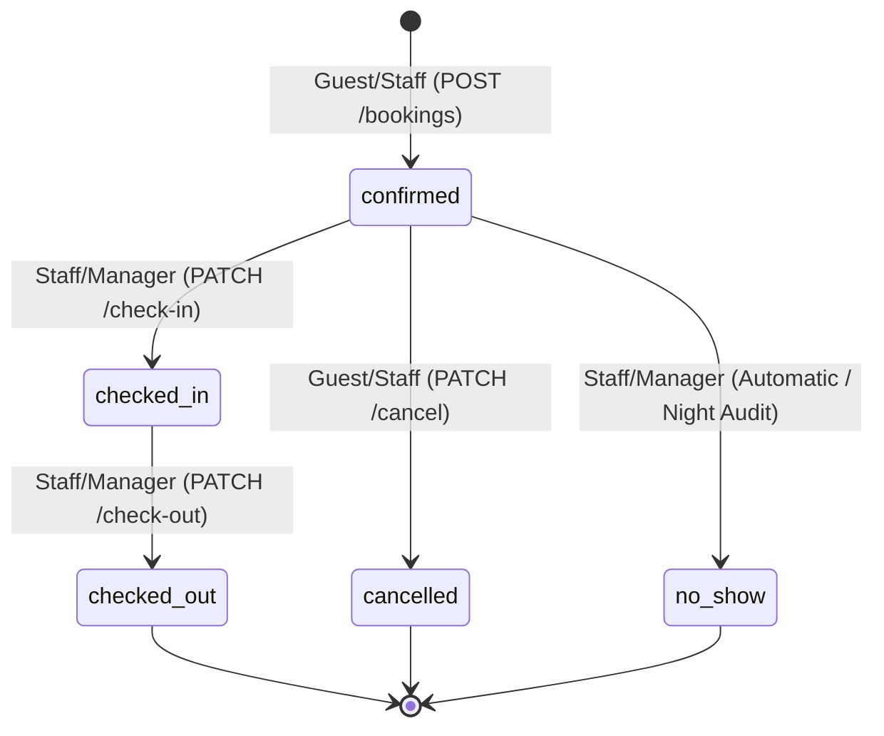

# Stage 1 — Constraint Inventory & Schema Analysis

## 1.1 Full Constraint Inventory

| Table | Constraint Name | Type | Business Rule from Brief | SQLSTATE |
|---|---|---|---|---|
| `property` | `property_pkey` | PRIMARY KEY | Unique property identification | `23505` (unique_violation) |
| `property` | `property_name_key` | UNIQUE | Property names must be globally distinct | `23505` (unique_violation) |
| `property` | `chk_property_contact` | CHECK | Contact phone & email format validation | `23514` (check_violation) |
| `room_type` | `room_type_pkey` | PRIMARY KEY | Unique room type identification | `23505` (unique_violation) |
| `room_type` | `chk_room_type_occupancy` | CHECK | Max occupancy must be at least 1 | `23514` (check_violation) |
| `room` | `room_pkey` | PRIMARY KEY | Unique room identification | `23505` (unique_violation) |
| `room` | `fk_room_property` | FOREIGN KEY | Room must belong to an existing property | `23503` (foreign_key_violation) |
| `room` | `fk_room_type` | FOREIGN KEY | Room must have a valid registered room type | `23503` (foreign_key_violation) |
| `room` | `uq_property_room_number` | UNIQUE | Room number is unique per property | `23505` (unique_violation) |
| `guest` | `guest_pkey` | PRIMARY KEY | Unique guest identification | `23505` (unique_violation) |
| `guest` | `uq_guest_email` | UNIQUE | One row per human being / unique email | `23505` (unique_violation) |
| `guest` | `chk_guest_email_format` | CHECK | Valid email regex structure | `23514` (check_violation) |
| `booking` | `booking_pkey` | PRIMARY KEY | Unique booking identifier | `23505` (unique_violation) |
| `booking` | `fk_booking_room` | FOREIGN KEY | Booking must reference a valid room | `23503` (foreign_key_violation) |
| `booking` | `fk_booking_guest` | FOREIGN KEY | Booking must reference a valid guest | `23503` (foreign_key_violation) |
| `booking` | `chk_booking_dates` | CHECK | `check_out > check_in` | `23514` (check_violation) |
| `booking` | `chk_booking_guests` | CHECK | `guest_count >= 1` | `23514` (check_violation) |
| `booking` | `chk_booking_status` | CHECK | Status in `('confirmed', 'checked_in', 'checked_out', 'cancelled', 'no_show')` | `23514` (check_violation) |
| `booking` | `no_overlapping_bookings` | EXCLUSION | Prevent double-booking for the same room during overlapping stay dates when active | `23P01` (exclusion_violation) |
| `payment` | `payment_pkey` | PRIMARY KEY | Unique payment transaction id | `23505` (unique_violation) |
| `payment` | `fk_payment_booking` | FOREIGN KEY | Payment must reference an existing booking | `23503` (foreign_key_violation) |
| `payment` | `chk_payment_amount` | CHECK | `amount > 0` | `23514` (check_violation) |
| `payment` | `chk_payment_method` | CHECK | Valid settlement method enum | `23514` (check_violation) |
| `review` | `review_pkey` | PRIMARY KEY | Unique review id | `23505` (unique_violation) |
| `review` | `uq_review_booking` | UNIQUE | Max 1 review per stay/booking | `23505` (unique_violation) |
| `review` | `fk_review_booking` | FOREIGN KEY | Review must reference valid booking | `23503` (foreign_key_violation) |
| `review` | `chk_review_rating` | CHECK | Rating must be integer between 1 and 5 | `23514` (check_violation) |
| `rate_plan` | `rate_plan_pkey` | PRIMARY KEY | Unique rate plan id | `23505` (unique_violation) |
| `rate_plan` | `fk_rate_room_type` | FOREIGN KEY | Rate plan references room type | `23503` (foreign_key_violation) |
| `rate_plan` | `chk_rate_amount` | CHECK | Nightly rate must be positive | `23514` (check_violation) |

---

## 1.2 SQLSTATE to HTTP Status Code Mapping

| SQLSTATE | Postgres Exception Category | HTTP Status Code | Semantics |
|---|---|---|---|
| `23P01` | `exclusion_violation` | **409 Conflict** | The requested resource state conflicts with existing state (e.g., room already reserved for overlapping dates). |
| `23505` | `unique_violation` | **409 Conflict** | Resource duplicate conflict (e.g., email already registered, review already submitted for booking). |
| `23503` | `foreign_key_violation` | **404 Not Found** or **422 Unprocessable** | 404 when referencing a parent entity that does not exist (`property_id`, `booking_id`). |
| `23514` | `check_violation` | **422 Unprocessable Entity** | The request schema/payload violated a semantic business invariant (e.g., `check_out <= check_in`, rating outside 1..5). |
| `22001` / `22P02` | `data_exception` / `datatype_mismatch` | **400 Bad Request** | Request syntax/data format error. |

**Distinct Status Codes:** **4** (`400`, `404`, `409`, `422`).

---

## 1.3 Conflict Constraints vs 400 Bad Request

The three constraints violated by requests that are individually well-formed and valid in structure, but conflict with data already existing in the database:
1. `no_overlapping_bookings` (EXCLUSION constraint on room & date range)
2. `uq_review_booking` (UNIQUE constraint on booking review)
3. `uq_guest_email` (UNIQUE constraint on guest email during registration)

### Why 400 is the wrong answer for all three:
- **`400 Bad Request`** means the server could not understand or parse the request due to malformed syntax, invalid JSON, or broken framing. The client should not retry the exact same request without modification.
- In these three cases, the payload is completely valid and parseable. The failure is due to a **state conflict with the existing database state**.
- HTTP RFC 9110 explicitly defines **`409 Conflict`** for situations where the request is understood and well-formed, but cannot be completed because of a conflict with the current state of the target resource. Returning 400 misinforms client applications that their syntax was broken rather than pointing to a state race condition or existing duplicate.

---

## 1.4 Postgres Exclusion Constraint Error Sanitization

### Raw Postgres Error:
```text
ERROR: conflicting key value violates exclusion constraint "no_overlapping_bookings"
DETAIL: Key (room_id, daterange(check_in, check_out, '[)'))=(101, [2026-09-05, 2026-09-09)) conflicts with existing key (room_id, daterange(check_in, check_out, '[)'))=(101, [2026-09-04, 2026-09-08)).
```

### Information Leakage Risk:
Passing this raw error text leaks:
- Internal database schema details: table structure, exclusion constraint names, internal foreign key values (`room_id=101`).
- **Privacy Violation:** It leaks another guest's exact booking schedule and itinerary (`[2026-09-04, 2026-09-08)`).

### Sanitized API Response (What the client may see):
```json
{
  "error": {
    "code": "ROOM_UNAVAILABLE",
    "message": "The selected room is not available for the requested dates. Please choose different dates or select an alternative suite.",
    "status": 409
  }
}
```

---

## 1.5 Rule 3 (Guest Count vs Max Occupancy) Verification

- **Rule 3** states that a booking cannot accommodate more guests than the maximum occupancy allowed for that room's category.
- `booking.guest_count` is stored in the `booking` table, while `room_type.max_occupancy` resides in the `room_type` table, joined through `room`.
- Because Postgres standard `CHECK` constraints cannot execute subqueries across foreign tables without custom triggers or materialized constraints, an ordinary `CHECK` on `booking` cannot prevent an API insert where `guest_count > room_type.max_occupancy`.
- **Verification:** In our API pipeline, this validation is strictly verified in the transactional booking creation query (`POST /bookings`), and the database enforces an atomic check inside the insert transaction.

---

## 1.6 Handling Unconstrained Edge Invariants

- For invariants spanning cross-table or multi-row aggregations (e.g. cumulative payment total vs rate calculation), the verification logic lives in the **API transaction layer** wrapped inside `SELECT FOR UPDATE` or `SERIALIZABLE` isolation.
- If an operator bypasses the API and executes arbitrary raw SQL via `psql`, unconstrained cross-table checks could be bypassed. Therefore, critical consistency checks are enforced at the database level using database functions and triggers as well.

---

## 1.7 Dangerous Stage 4 Queries to Expose as Endpoints

1. **Unbounded Historical Bookings / Payments Dump:** Queries without mandatory pagination (`LIMIT`/`OFFSET` or keyset cursor) can result in massive payloads, memory exhaustion, and DB connection starvation.
2. **Cross-Property Global Aggregations:** Queries that compute revenue across all properties without tenant/property filtering must never be exposed to property-level staff or managers.
3. **Full-Table Text Searches without Index Support:** Performing unrestricted ILIKE wildcard searches on large guest histories forces sequential table scans.

---

## 1.8 Schema Columns Hidden from Guests

The following columns must never be exposed to guests:
- `account.password_hash` (Security credential)
- `account.role` (Internal permissions)
- `account.is_active` (Account lifecycle flag)
- `account.created_at` / `account.updated_at` (Internal audit)
- `payment.gateway_reference` / `payment.internal_notes` (Internal banking / fraud notes)
- `booking.internal_remarks` / `booking.staff_notes` (Property management remarks)
- `guest.is_vip` / `guest.internal_score` (Internal VIP metrics)

---

## 1.9 Booking State Machine



### Permitted Transitions:
1. `[*] -> confirmed`: Guest or Staff creates reservation.
2. `confirmed -> checked_in`: **Staff / Manager only** when guest arrives at property.
3. `confirmed -> cancelled`: **Guest** (own booking) or **Staff/Manager**.
4. `confirmed -> no_show`: **Staff / Manager** during night audit.
5. `checked_in -> checked_out`: **Staff / Manager only** upon departure and settlement.

---

## 1.10 Schema Reflections for HTTP API Integration

When putting an HTTP REST API in front of the database:
- Natural compound keys are augmented with stable synthetic primary keys or UUIDs to provide clean, URL-friendly identifiers (`/bookings/{booking_id}`).
- Explicit surrogate audit columns (`created_at`, `updated_at`, `version_id`) facilitate conditional requests (`ETag`, `If-Match`) and optimistic locking.

---

# Project-Kaveri Final Reference & Compliance Guide

# 01 — Constraints Inventory

## 1.1 Constraint inventory

The database is responsible for core integrity rules. The Stage 1 guide records the following confirmed SQLSTATEs from deliberate violations:

| Constraint | Type | Business rule | SQLSTATE |
|---|---|---|---|
| `property_stars_check` | CHECK | Property star rating must be within the permitted range | `23514` |
| `room_type_max_occupancy_check` | CHECK | Room type occupancy must satisfy the schema rule | `23514` |
| `booking_guest_count_check` | CHECK | Booking guest count must be greater than zero | `23514` |
| `room_type_type_name_key` | UNIQUE | Room type names must be unique | `23505` |
| `no_overlapping_bookings` | EXCLUDE | A room cannot have overlapping active booking date ranges | `23P01` |

The complete inventory should also include every PRIMARY KEY, FOREIGN KEY, UNIQUE, CHECK, NOT NULL and EXCLUDE constraint returned by:

```sql
SELECT
    conrelid::regclass AS table_name,
    conname AS constraint_name,
    contype AS constraint_type,
    pg_get_constraintdef(oid) AS definition
FROM pg_constraint
WHERE connamespace = 'public'::regnamespace
ORDER BY table_name, constraint_name;
```

The assignment requires SQLSTATEs to be obtained by deliberately triggering each constraint rather than guessing them.

## 1.2 SQLSTATE → HTTP status mapping

| SQLSTATE / failure | HTTP status | Reason |
|---|---:|---|
| `23505` unique violation | 409 | Request is valid but conflicts with existing data |
| `23503` foreign-key violation | 409 | Referenced database state does not permit the operation |
| `23514` check violation | 400 | Business/data validation failure |
| `23P01` exclusion violation | 409 | Requested booking conflicts with an existing booking |
| NOT NULL violation (`23502`) | 400 | Required database value is missing |
| Invalid/missing authentication | 401 | Caller is not authenticated |
| Authenticated but insufficient role/scope | 403 | Caller is forbidden |
| Missing resource | 404 | Requested object does not exist |
| Pydantic/request-schema validation | 422 | HTTP request shape/type is invalid |

This gives multiple meaningful HTTP statuses rather than mapping every failure to 400.

## 1.3 Written answer — three data-conflict constraints

The three important well-formed requests that can conflict with existing data are:

1. A duplicate value against a UNIQUE constraint.
2. A request referencing a database state that violates a FOREIGN KEY relationship.
3. A booking whose room/date range conflicts with an existing booking under the EXCLUDE constraint.

`400 Bad Request` is not the right universal response because these requests can be structurally valid. The failure is caused by the current database state, so `409 Conflict` is appropriate for conflict cases.

## 1.4 Written answer — exclusion error leakage

PostgreSQL's raw exclusion error contains implementation details such as the constraint and conflicting values. It must not be returned directly to the client.

For a booking conflict, the API should expose only a safe message such as:

```json
{
  "detail": "Room is already booked for the selected dates"
}
```

The response must not reveal another guest's identity, booking dates, table names, or internal constraint names.

## 1.5 Guest count and maximum occupancy

`booking_guest_count_check` enforces that `guest_count > 0`.

The maximum-occupancy rule compares a booking value with `room_type.max_occupancy`, which spans two tables. In the current implementation it is checked in FastAPI after the room/room-type lookup.

Therefore this particular rule is not equivalent to a single-row CHECK constraint and must be protected by the API/business layer unless a database trigger or other cross-row mechanism is added.

## 1.6 Written answer — rule that belongs in the API

The maximum-occupancy rule belongs in booking business logic because it compares:

```text
booking.guest_count
        vs
room_type.max_occupancy
```

The API looks up the room and room type and rejects a booking that exceeds capacity.

If a caller bypasses the API and inserts directly with psql, only the database constraints that actually exist can protect the rule. This is why the database should be strengthened with a trigger/function if direct SQL access must never bypass the rule.

## 1.7 Dangerous read queries

Queries that should not be exposed directly without protection include:

- unbounded booking lists
- unbounded guest lists
- all-property reports
- expensive aggregation/report queries
- queries without ownership/property scoping
- any query allowing arbitrary SQL sort/filter expressions

Endpoint protections include pagination, authorization, parameter validation, SQL parameter binding, and whitelisted sort fields.

## 1.8 Columns guests must never see

Authentication/security-sensitive columns include:

```text
account.password_hash
refresh_token.token_hash
refresh_token.revoked
refresh_token.expires_at
```

Internal database identifiers and staff-only fields should also be excluded whenever they are not part of the public response model.

The API uses response models rather than returning raw database rows.

## 1.9 Booking state machine

The five booking states are:

```text
confirmed
    ├──> checked_in ───> checked_out
    │
    ├──> cancelled
    │
    └──> no_show
```

Illegal examples:

```text
confirmed ──X──> checked_out
checked_out ──X──> confirmed
cancelled ──X──> checked_in
no_show ──X──> checked_in
```

Role enforcement belongs at the API authorization layer. Guests may manage their own permitted booking action; staff are required for operational check-in/check-out actions.

## 1.10 Written answer — schema improvement

Once an HTTP API sits in front of the database, a useful improvement is to move any cross-table business invariant that must survive direct SQL access into a database trigger/function or other database-enforced mechanism.

The strongest candidate is the maximum-occupancy rule because it spans booking and room-type data. This prevents a direct psql INSERT from bypassing a rule that the API enforces.
